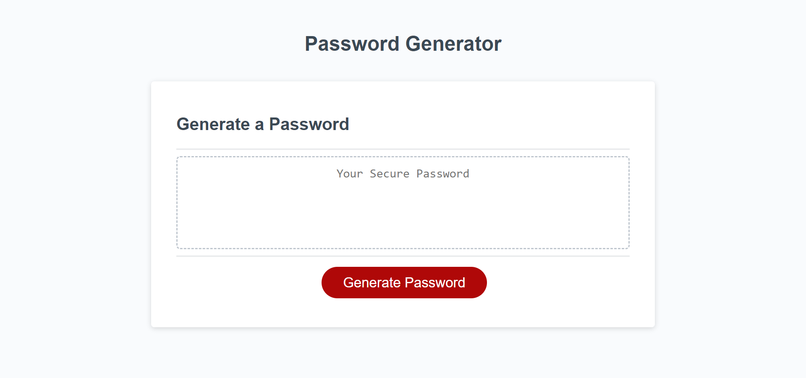

# passWord-generation3

## Description

This password generator includes an html and css file as well as a JS file that will ask a user with a pop-up window how many characters the user would like in their password. Once the user provides a number indicating how many characters they would like, the window will continue to initiate pop-ups that ask the user if they would like Uppercase/Lowercase letters, special, and numbers in their password. Once user has answered all the pop-ups shown, a password that fits all the requirements given by the user will show up within the password generator box. 

## Usage
The Password generator can be accessed through here: https://drog41813.github.io/passWord-generation3/ 

## Credits
The following site assisted in basic and general JS concepts as well as how to operate JS itself using various methods and syntax: https://www.w3schools.com/js/js_syntax.asp
The following site helped with learning how to set up various JS algorithms as well as how they affected your code as a whole: https://www.freecodecamp.org/learn/javascript-algorithms-and-data-structures/#basic-javascript

